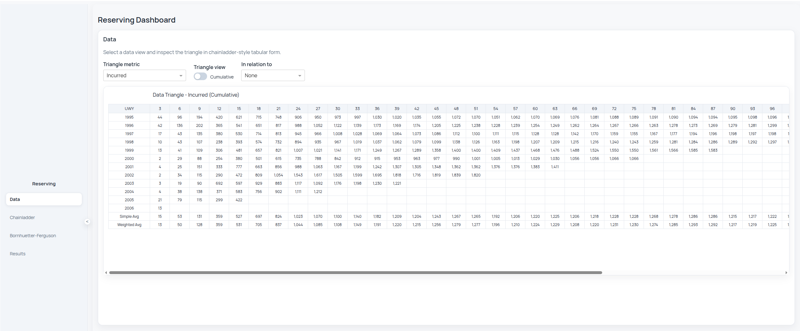
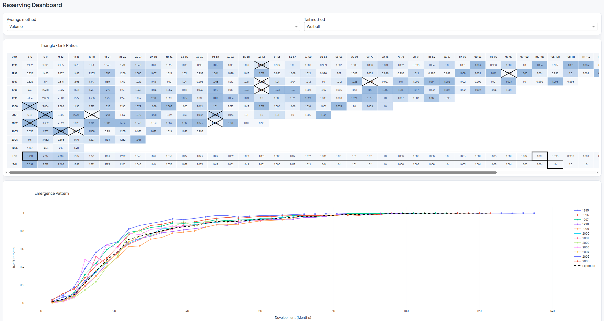
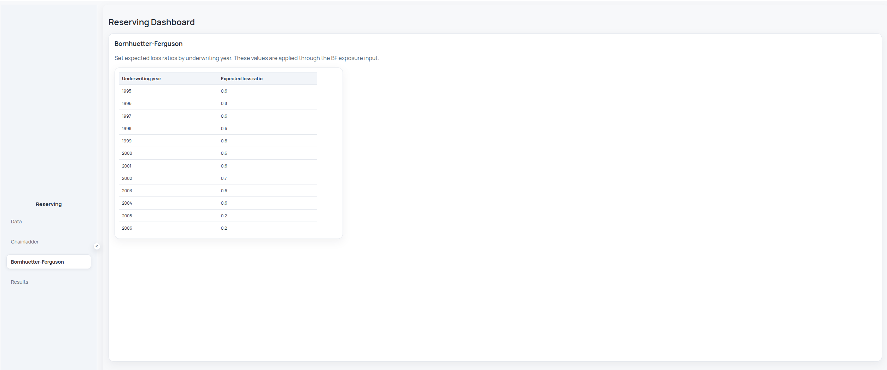

# reserving-studio

This is currently a personal project to build a reserving workflow, including a minimalistic GUI, to familiarize myself with and learn the amazing `chainladder-python` package for actuarial loss reserving.

## Preview

The Data tab shows claims and premium triangles. You can toggle between incremental and cumulative triangles. Each triangle can also be viewed in relation to another one, for example incurred in relation to premium.



The Chainladder tab displays link ratios, loss development factors, and fitted projections. Different weighting schemes can be applied, and selected link ratios can be dropped. For tail estimation, you can choose different methods, set the fitting interval, and define the starting point.






# Get started

## Install (uv)

```bash
uv venv
source .venv/bin/activate
uv pip install -r requirements.txt
```

## Activate environment

```bash
source .venv/bin/activate
```

## Run server (Dash)

```bash
uv run python -m source.app
```

Open http://127.0.0.1:8050

## Default input workflow

- The app startup uses the chainladder quarterly sample claims data and the local premium file at `data/quarterly_premium.csv`.
- Inputs are normalized through `source/claims_collection.py` and `source/premium_repository.py` before building the reserving triangle.
- This keeps one consistent ingestion path for sample data now, and allows later extension to CSV/SQL adapters.

## Scripted custom input workflow

- For custom SQL/CSV reads, use your own Python script to prepare claims and premium dataframes, then pass them into `source.app.build_workflow_from_dataframes(...)`.
- Start the GUI from script with `source.app.run_interactive_session(...)`.
- In the Results tab, click **Finalize & Continue** to hand control back to your script with finalized parameters and results payload.
- A ready-to-run quarterly example is available at `examples/run_quarterly_interactive.py`.
- A CLRD portfolio-level example is available at `examples/run_clrd_interactive.py`.
- A SQL-template example runner is available at `examples/run_sql_interactive.py`.
- Both examples now load their own YAML config (`examples/config_quarterly.yml` and `examples/config_clrd.yml`).
- Use `granularity: quarterly|yearly` in the example config to control how claims and premium data are aggregated.
- The CLRD example still filters to `LOB = comauto` by default (`workflow.clrd_lob` in config).
- SQL templates live in `examples/sql/` and are referenced from `examples/config_sql_template.yml`.
- SQL connection settings are defined in YAML (`driver`, `server`, `database`, `trusted_connection`).
- You can configure source-to-canonical column mapping in YAML via `workflow.input.claims.column_map` and `workflow.input.premium.column_map`.

```bash
uv run python examples/run_quarterly_interactive.py
uv run python examples/run_clrd_interactive.py
uv run python examples/run_sql_interactive.py
```

The script blocks until you click **Finalize & Continue** in the Results tab, then resumes with a finalized payload (`params_store`, `results_store`, and numeric `results_df`) for downstream ETL/reporting.

## Run dashboard E2E tests

The E2E suite uses Playwright to open the Dash app in a real Chromium browser and verify key user flows deterministically (drop selection recalculation and BF apriori-driven results updates).

```bash
uv run python -m playwright install chromium
uv run python -m pytest tests/e2e -m e2e -q
```

## Optional: custom config path

```bash
RESERVING_CONFIG=config.yml uv run python -m source.app
```
