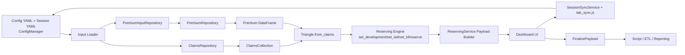
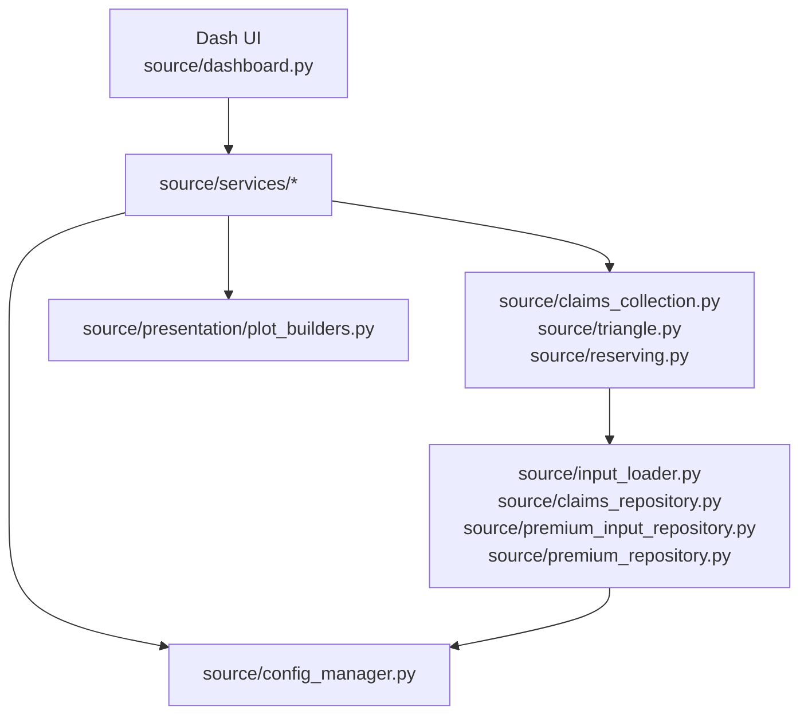
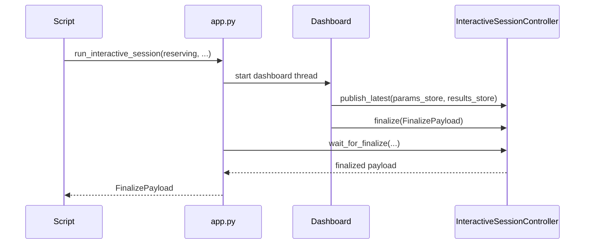
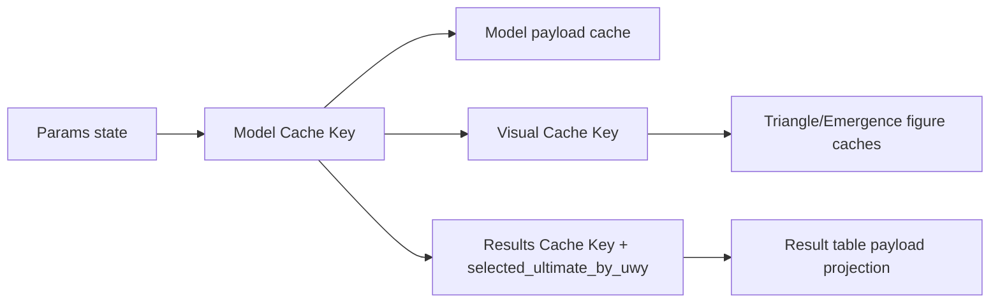

# Architecture Diagrams

This page provides visual maps for the local `source/` reserving app.

## 1) End-to-end workflow

## 2) Runtime layering

## 3) Interactive-session contract path

## 4) Cache-key model (high level)

Notes:

- Cache logic is implemented in `source/services/cache_service.py`.
- Recalculation orchestration and payload assembly are in `source/services/reserving_service.py`.
